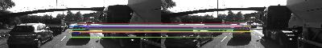
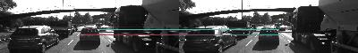
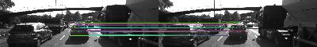
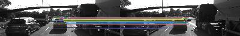
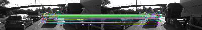
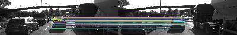

## Camera Based 2D Feature Tracking

### MP.1 Data Buffer Optimization

Changed std::vector to using boost::circular_buffer.

## MP.2 Keypoint Detection
<font size="3">
Implement detectors HARRIS, FAST, BRISK, ORB, AKAZE, and SIFT and make them selectable by setting a string accordingly. Added detKeypointsModern to handle if else statement of detectorType</font>

---
### HARRIS:
```C++
double detKeypointsHarris(vector<cv::KeyPoint> &keypoints, cv::Mat &img)
{
    // Detector parameters
  int blockSize = 2;     // for every pixel, a blockSize × blockSize neighborhood is considered
  int apertureSize = 3;  // aperture parameter for Sobel operator (must be odd)
  int minResponse = 100; // minimum value for a corner in the 8bit scaled response matrix
  double k = 0.04;       // Harris parameter (see equation for details)
  // Detect Harris corners and normalize output
  cv::Mat dst, dst_norm, dst_norm_scaled;
  dst = cv::Mat::zeros(img.size(), CV_32FC1);
  double t = (double)cv::getTickCount();
  cv::cornerHarris(img, dst, blockSize, apertureSize, k, cv::BORDER_DEFAULT);
  cv::normalize(dst, dst_norm, 0, 255, cv::NORM_MINMAX, CV_32FC1, cv::Mat());
  cv::convertScaleAbs(dst_norm, dst_norm_scaled);
  // Look for prominent corners and instantiate keypoints
  //vector<cv::KeyPoint> keypoints;
  double maxOverlap = 0.0; // max. permissible overlap between two features in %, used during non-maxima suppression
  for (size_t j = 0; j < dst_norm.rows; j++)
  {
      for (size_t i = 0; i < dst_norm.cols; i++)
      {
          int response = (int)dst_norm.at<float>(j, i);
          if (response > minResponse)
          { // only store points above a threshold

              cv::KeyPoint newKeyPoint;
              newKeyPoint.pt = cv::Point2f(i, j);
              newKeyPoint.size = 2 * apertureSize;
              newKeyPoint.response = response;

              // perform non-maximum suppression (NMS) in local neighbourhood around new key point
              bool bOverlap = false;
              for (auto it = keypoints.begin(); it != keypoints.end(); ++it)
              {
                  double kptOverlap = cv::KeyPoint::overlap(newKeyPoint, *it);
                  if (kptOverlap > maxOverlap)
                  {
                      bOverlap = true;
                      if (newKeyPoint.response > (*it).response)
                      {                      // if overlap is >t AND response is higher for new kpt
                          *it = newKeyPoint; // replace old key point with new one
                          break;             // quit loop over keypoints
                      }
                  }
              }
              if (!bOverlap)
              {                                     // only add new key point if no overlap has been found in previous NMS
                  keypoints.push_back(newKeyPoint); // store new keypoint in dynamic list
              }
          }
      } // eof loop over cols

  }     // eof loop over rows
  t = ((double)cv::getTickCount() - t) / cv::getTickFrequency();

  return t;
}
```
---
### FAST:
```C++
double detKeypointsFast(std::vector<cv::KeyPoint> &keypoints, cv::Mat &img)
{
  int threshold = 30;       // difference between intensity of the central pixel and pixels of a circle around this pixel
  bool bNMS = true;
  cv::FastFeatureDetector::DetectorType type = cv::FastFeatureDetector::TYPE_9_16; // TYPE_9_16, TYPE_7_12, TYPE_5_8
  cv::Ptr<cv::FeatureDetector> detector = cv::FastFeatureDetector::create(threshold, bNMS, type);
  double t = (double)cv::getTickCount();
  detector->detect(img, keypoints);
  t = ((double)cv::getTickCount() - t) / cv::getTickFrequency();
  return t;
}
```
---
### BRISK:
```C++
double detKeypointsBrisk(std::vector<cv::KeyPoint> &keypoints, cv::Mat &img)
{
  int Thresh = 100;
  int Octave = 4;
  float PatternScales = 1.0f;
  //cv::Ptr<cv::BRISK> detector = cv::BRISK::create(Thresh, Octave, PatternScales);
  cv::Ptr<cv::BRISK> detector = cv::BRISK::create();
  double t = (double)cv::getTickCount();
  detector->detect(img,keypoints);
  t = ((double)cv::getTickCount() - t) / cv::getTickFrequency();
  return t;
}
```
---
### ORB:
```C++
double detKeypointsOrb(std::vector<cv::KeyPoint> &keypoints, cv::Mat &img)
{
  int nFeatures = 100;
  int nLevels = 8;
  float scaleFactor = 1.2f;
  //cv::Ptr<cv::ORB> detector = cv::ORB::create(nFeatures, scaleFactor, nLevels);
  cv::Ptr<cv::ORB> detector = cv::ORB::create();
  double t = (double)cv::getTickCount();
  detector->detect(img,keypoints);
  t = ((double)cv::getTickCount() - t) / cv::getTickFrequency();
  return t;
}
``` 

---
### AKAZE:
```C++
double detKeypointsAkaze(std::vector<cv::KeyPoint> &keypoints, cv::Mat &img)
{

  cv::Ptr<cv::AKAZE> detector = cv::AKAZE::create();
  double t = (double)cv::getTickCount();
  detector->detect(img,keypoints);
  t = ((double)cv::getTickCount() - t) / cv::getTickFrequency();
  return t;
}

```
---
### SIFT:
```C++
double detKeypointsSift(std::vector<cv::KeyPoint> &keypoints, cv::Mat &img)
{
  //int numFeatures = 400;
  cv::Ptr<cv::xfeatures2d::SIFT> detector = cv::xfeatures2d::SIFT::create();
  double t = (double)cv::getTickCount();
  detector->detect(img,keypoints);
  t = ((double)cv::getTickCount() - t) / cv::getTickFrequency();
  return t;
}

```

## MP.3 Keypoint Removal
<font size="3">
Remove all keypoints outside of a pre-defined rectangle and only use the keypoints within the rectangle for further processing.

The following code keeps the keypoints from the previous vehcle only:</font>

```C++

void focusOnVehicle(std::vector<cv::KeyPoint>& keypoints, cv::Rect vehicleRect)
{
  vector<cv::KeyPoint>::iterator it = keypoints.begin();
      while(it != keypoints.end())
      {
        if(!vehicleRect.contains((*it).pt))
        {
          it = keypoints.erase(it);
        }else
        {
          it++;
        }
      }
}
```


## MP.4 Keypoint Descriptors
<font size="3">
Implement descriptors BRIEF, ORB, FREAK, AKAZE and SIFT and make them selectable by setting a string accordingly.
</font>

```C++
// Use one of several types of state-of-art descriptors to uniquely identify keypoints
void descKeypoints(vector<cv::KeyPoint> &keypoints, cv::Mat &img, cv::Mat &descriptors, string descriptorType)
{
    cv::Ptr<cv::DescriptorExtractor> extractor;
    if (descriptorType.compare("BRISK") == 0)
    {
        int threshold = 30;        // FAST/AGAST detection threshold score.
        int octaves = 3;           // detection octaves (use 0 to do single scale)
        float patternScale = 1.0f; // apply this scale to the pattern used for sampling the neighbourhood of a keypoint.

        extractor = cv::BRISK::create(threshold, octaves, patternScale);
    }
    else if(descriptorType.compare("BRIEF") == 0)
    {
      //cv::Ptr<cv::xfeatures2d::BriefDescriptorExtractor> extractor;
      extractor = cv::xfeatures2d::BriefDescriptorExtractor::create(64);

    }
    else if(descriptorType.compare("ORB") == 0)
    {
    //  cv::Ptr<cv::ORB> extractor;
      extractor = cv::ORB::create();
    }
    else if(descriptorType.compare("FREAK") == 0)
    {
      //cv::Ptr<cv::xfeatures2d::FREAK> extractor;
      extractor = cv::xfeatures2d::FREAK::create();
    }
    else if(descriptorType.compare("AKAZE") == 0)
    {
      //cv::Ptr<cv::xfeatures2d::FREAK> extractor;
      extractor = cv::AKAZE::create();
    }
    else
    {
      extractor = cv::xfeatures2d::SIFT::create();
    //cv::Ptr<cv::xfeatures2d::SIFT> detector = cv::xfeatures2d::SIFT::create();
    }

    // perform feature description
    double t = (double)cv::getTickCount();
    extractor->compute(img, keypoints, descriptors);
    t = ((double)cv::getTickCount() - t) / cv::getTickFrequency();
    cout << descriptorType << " descriptor extraction in " << 1000 * t / 1.0 << " ms" << endl;
}
```

## MP.5 Descriptor Matching
<font size="3">
Implement FLANN matching as well as k-nearest neighbor selection. Both methods must be selectable using the respective strings in the main function.
    </font>

## MP.6 Descriptor Distance Ratio
<font size="3">
Use the K-Nearest-Neighbor matching to implement the descriptor distance ratio test, which looks at the ratio of best vs. second-best match to decide whether to keep an associated pair of keypoints.</font>'

---
### FLANN matching
```C++
    else if (matcherType.compare("MAT_FLANN") == 0)
    {
        if (descSource.type() != CV_32F || descRef.type() != CV_32F)
        { // OpenCV bug workaround : convert binary descriptors to floating point due to a bug in current OpenCV implementation
            descSource.convertTo(descSource, CV_32F);
            descRef.convertTo(descRef, CV_32F);
        }
        matcher = cv::DescriptorMatcher::create(cv::DescriptorMatcher::FLANNBASED);
    }
```

---
### k-nearest neighbor selection
<font size="3">
Use the K-Nearest-Neighbor matching to implement the descriptor distance ratio test, which looks at the ratio of best vs. second-best match to decide whether to keep an associated pair of keypoints </font>

```C++
else if (selectorType.compare("SEL_KNN") == 0)
    { 
        // k nearest neighbors (k=2)
        std::vector< std::vector<cv::DMatch> > knn_matches;
        matcher->knnMatch( descSource, descRef, knn_matches, 2 );
        
        //-- Filter matches using the Lowe's distance ratio test
        const float ratio_thresh = 0.7f;
        for (size_t i = 0; i < knn_matches.size(); i++)
        {
            if (knn_matches[i][0].distance < ratio_thresh * knn_matches[i][1].distance)
            {
                matches.push_back(knn_matches[i][0]);
            }
        }
    }
```

## MP.7 Performance Evaluation 1


[//]: # (Image References)

[image1_1]: ./images/SHITOMASI.jpg "SHITOMASI"


<font size="3">
Count the number of keypoints on the preceding vehicle for all 10 images and take note of the distribution of their neighborhood size. Do this for all the detectors you have implemented.</font>


#### Number of Key-points for 10 Images

| Detectors | Number of Key-points |
| :-------: | :------------------: |
| SHITOMASI |        13423         |
|  HARRIS   |         1737         |
|   FAST    |        17874         |
|   BRISK   |        27116         |
|    ORB    |         5000         |
|   AKAZE   |        13429         |
|   SIFT    |        13862         |


### Neighborhood Size

#### SHITOMASI
<figure>
    
</figure>


#### HARRIS
<figure>
    
</figure>


#### SIFT
<figure>
    
</figure>


#### FAST
<figure>
    
</figure>


#### BRISK
<figure>
    
</figure>


#### ORG
<figure>
    
</figure>


#### AKAZE
<figure>
    
</figure>

## MP.8 Performance
<font size="3">
Count the number of matched keypoints for all 10 images using all possible combinations of detectors and descriptors. In the matching step, the BF approach is used with the descriptor distance ratio set to 0.8.
    </font>
    
    

#### Number of Matched Key-points for 10 Images

| Detectors\Descriptors | BRISK |  BRIEF  |      ORB      | FREAK | AKAZE | SIFT |
| :-------------------: | :---: | :-----: | :-----------: | :---: | :---: | :--: |
|       SHITOMASI       |  347  | **413** |      398      |  341  |  N/A  | 405  |
|        HARRIS         |  141  |   206   |      162      |  144  |  N/A  | 163  |
|         FAST          |  281  |   336   |      332      |  295  |  N/A  | 291  |
|         BRISK         |  276  |   314   |      266      |  292  |  N/A  | 279  |
|          ORB          |  339  |   267   |      347      |  327  |  N/A  | 364  |
|         AKAZE         |  349  |   392   |      345      |  353  |  343  | 348  |
|         SIFT          |  201  |   249   | Out of Memory |  195  |  N/A  | 294  |

## MP.9 Performance

<font size="3">
Log the time it takes for keypoint detection and descriptor extraction. The results must be entered into a spreadsheet and based on this data, the TOP3 detector / descriptor combinations must be recommended as the best choice for our purpose of detecting keypoints on vehicles.</font>
    
#### Key-point Detection and Descriptor Extraction Time Consumption (in ms)

| Detectors\Descriptors |  BRISK  |    BRIEF    |      ORB      |  FREAK  |  AKAZE  |    SIFT    |
| :-------------------: | :-----: | :---------: | :-----------: | :-----: | :-----: | :--------: |
|       SHITOMASI       | 98.8398 |   82.6777   |    91.0227    | 328.525 |   N/A   |  180.6775  |
|        HARRIS         | 106.512 |   96.1124   |    108.656    | 338.423 |   N/A   |  151.436   |
|         FAST          | 12.7961 | **9.92533** |    12.1023    | 267.232 |   N/A   |  116.5025  |
|         BRISK         | 262.799 |   257.95    |    262.838    | 510.137 |   N/A   | 337.020527 |
|          ORB          | 53.0014 |   52.4011   |    58.3677    | 294.063 |   N/A   |  270.4355  |
|         AKAZE         | 387.531 |   383.136   |    378.456    | 584.215 | 753.823 |  458.371   |
|         SIFT          | 607.335 |   623.61    | Out of Memory | 805.025 |   N/A   |  1072.55   |


#### Efficiency (matches/ms)

| Detectors\Descriptors |  BRISK   |    BRIEF    |      ORB      |  FREAK   |  AKAZE   |   SIFT   |
| :-------------------: | :------: | :---------: | :-----------: | :------: | :------: | :------: |
|       SHITOMASI       | 3.51073  |   4.9953    |    4.37254    | 1.03797  |   N/A    | 2.24156  |
|        HARRIS         |  1.3238  |   2.14332   |    1.49094    | 0.425504 |   N/A    | 1.07636  |
|         FAST          | 21.9598  | **33.8528** |    27.4329    | 1.10391  |   N/A    | 2.49780  |
|         BRISK         | 1.05023  |   1.21729   |    1.01203    | 0.572395 |   N/A    | 0.827842 |
|          ORB          | 6.39606  |   5.09532   |    5.94507    | 1.11201  |   N/A    | 1.34597  |
|         AKAZE         | 0.900572 |   1.02314   |   0.911598    | 0.60423  | 0.455014 | 0.759210 |
|         SIFT          | 0.330954 |  0.399288   | Out of Memory | 0.242228 |   N/A    | 0.274113 |


## TOP3 detector / descriptor combinations

1. FAST + BRIEF
2. FAST + ORB
3. FAST + BRISK
