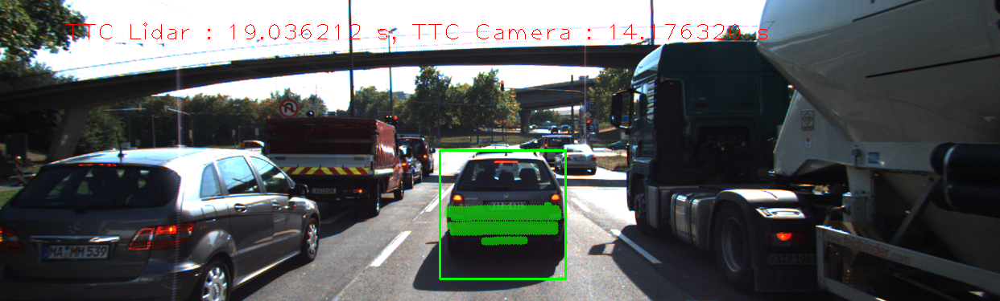
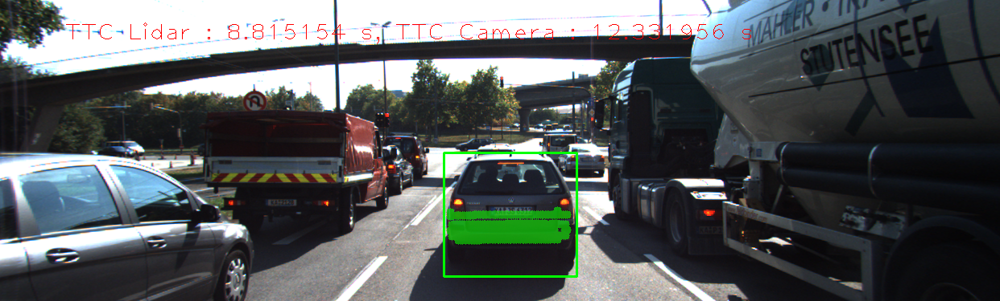

# SFND 3D Object Tracking

Welcome to the final project of the camera course. By completing all the lessons, you now have a solid understanding of keypoint detectors, descriptors, and methods to match them between successive images. Also, you know how to detect objects in an image using the YOLO deep-learning framework. And finally, you know how to associate regions in a camera image with Lidar points in 3D space. Let's take a look at our program schematic to see what we already have accomplished and what's still missing.


In this final project, you will implement the missing parts in the schematic. To do this, you will complete four major tasks: 
1. First, you will develop a way to match 3D objects over time by using keypoint correspondences. 
2. Second, you will compute the TTC based on Lidar measurements. 
3. You will then proceed to do the same using the camera, which requires to first associate keypoint matches to regions of interest and then to compute the TTC based on those matches. 
4. And lastly, you will conduct various tests with the framework. Your goal is to identify the most suitable detector/descriptor combination for TTC estimation and also to search for problems that can lead to faulty measurements by the camera or Lidar sensor. In the last course of this Nanodegree, you will learn about the Kalman filter, which is a great way to combine the two independent TTC measurements into an improved version which is much more reliable than a single sensor alone can be. But before we think about such things, let us focus on your final project in the camera course. 

## Dependencies for Running Locally
* cmake >= 2.8
  * All OSes: [click here for installation instructions](https://cmake.org/install/)
* make >= 4.1 (Linux, Mac), 3.81 (Windows)
  * Linux: make is installed by default on most Linux distros
  * Mac: [install Xcode command line tools to get make](https://developer.apple.com/xcode/features/)
  * Windows: [Click here for installation instructions](http://gnuwin32.sourceforge.net/packages/make.htm)
* Git LFS
  * Weight files are handled using [LFS](https://git-lfs.github.com/)
* OpenCV >= 4.1
  * This must be compiled from source using the `-D OPENCV_ENABLE_NONFREE=ON` cmake flag for testing the SIFT and SURF detectors.
  * The OpenCV 4.1.0 source code can be found [here](https://github.com/opencv/opencv/tree/4.1.0)
* gcc/g++ >= 5.4
  * Linux: gcc / g++ is installed by default on most Linux distros
  * Mac: same deal as make - [install Xcode command line tools](https://developer.apple.com/xcode/features/)
  * Windows: recommend using [MinGW](http://www.mingw.org/)

## Basic Build Instructions

1. Clone this repo.
2. Make a build directory in the top level project directory: `mkdir build && cd build`
3. Compile: `cmake .. && make`
4. Run it: `./3D_object_tracking`.


---
# Wright up
## [Rubric](https://review.udacity.com/#!/rubrics/2550/view) Points


#### 1. Match 3D Objects

Implement the method "matchBoundingBoxes", which takes as input both the previous and the current data frames and provides as output the ids of the matched regions of interest (i.e. the boxID property). Matches must be the ones with the highest number of keypoint correspondences.

```c++
void matchBoundingBoxes( std::vector<cv::DMatch> &matches,std::map<int, int> &bbBestMatches,DataFrame &prevFrame,DataFrame &currFrame )
{
    cv::Mat count( prevFrame.boundingBoxes.size(),currFrame.boundingBoxes.size(),CV_16UC1,cv::Scalar( 0 ) );
    for( auto itmatch = matches.begin();itmatch != matches.end();++itmatch ){
        for( auto itprev = prevFrame.boundingBoxes.begin();itprev != prevFrame.boundingBoxes.end();++itprev ){
            if( (*itprev).roi.contains( prevFrame.keypoints[(*itmatch).queryIdx].pt ) ){ // find bb in prev frame
                for( auto itcurr = currFrame.boundingBoxes.begin();itcurr != currFrame.boundingBoxes.end();++itcurr ){
                    if( (*itcurr).roi.contains( currFrame.keypoints[(*itmatch).trainIdx].pt ) ){ // find the correspoding bb in curr frame
                        count.at<u_int16_t>( (*itprev).boxID,(*itcurr).boxID ) += 1; 
                    }
                }       
            }
        }
    }
    int max = 0;
    int ind = 0;
    for( int prev = 0;prev<count.rows;prev++ ){
        max = 0;
        ind = 0;
        for( int curr = 0;curr<count.cols;curr++ ){
            if( count.at<u_int16_t>( prev,curr ) > max ){
                max = count.at<u_int16_t>( prev,curr );
                ind = curr;
            }
        }
        if( max > 0 ) bbBestMatches.insert( std::pair<int,int>( prev,ind ) ); 
    }
}
```

#### 2. Compute Lidar-based TTC

Compute the time-to-collision in second for all matched 3D objects using only Lidar measurements from the matched bounding boxes between current and previous frame.

In order to deal with outlier Lidar points in a statistically robust way we use the interquartile range to get the median so we have a more consistent TTC value.

```c++
double medianOfX(std::vector<LidarPoint> &lidarPoints, double index)
{
    int floorIndex = (int)index;
    if(floorIndex == index)
    {
        //whole
        return lidarPoints[floorIndex].x;

    }
    else
    {
        return (lidarPoints[floorIndex].x + lidarPoints[floorIndex+1].x)/2;
    }
    
}

double getInterquartileMedianOfX(std::vector<LidarPoint> &lidarPoints)
{
    // This std::sort with a lambda mutates lidarPoints, a vector of LidarPoint
    std::sort(lidarPoints.begin(), lidarPoints.end(), [](LidarPoint a, LidarPoint b) {
        return a.x < b.x;  // Sort ascending on the x coordinate only
    });

    int n = lidarPoints.size();

    //first quartile
    double q1_index = (n+1)/4;

    double Q1 = medianOfX(lidarPoints, q1_index);

    double q3_index = 3*(n+1)/4;

    double Q3 = medianOfX(lidarPoints, q3_index);

    return (Q3 + Q1) /2;
}

// Compute time-to-collision (TTC) based on relevant lidar points
void computeTTCLidar(std::vector<LidarPoint> &lidarPointsPrev,
                     std::vector<LidarPoint> &lidarPointsCurr, double frameRate, double &TTC)
{
    // In each frame, take the median x-distance as our more robust estimate.
    // If performance is suffering, consider taking the median of a random subset of the points.
    
    double d0 = getInterquartileMedianOfX(lidarPointsPrev);
    double d1 = getInterquartileMedianOfX(lidarPointsCurr);

    // Using the constant-velocity model (as opposed to a constant-acceleration model)
    // TTC = d1 * delta_t / (d0 - d1)
    // where: d0 is the previous frame's closing distance (front-to-rear bumper)
    //        d1 is the current frame's closing distance (front-to-rear bumper)
    //        delta_t is the time elapsed between images (1 / frameRate)
    // Note: this function does not take into account the distance from the lidar origin to the front bumper of our vehicle.
    // It also does not account for the curvature or protrusions from the rear bumper of the preceding vehicle.
    TTC = d1 * (1.0 / frameRate) / (d0 - d1);
}
```

#### 3. Associate Keypoint Correspondences with Bounding Boxes

Prepare the TTC computation based on camera measurements by associating keypoint correspondences to the bounding boxes which enclose them. All matches which satisfy this condition must be added to a vector in the respective bounding box.

```c++
// associate a given bounding box with the keypoints it contains
void clusterKptMatchesWithROI(BoundingBox &boundingBox, std::vector<cv::KeyPoint> &kptsPrev, std::vector<cv::KeyPoint> &kptsCurr, std::vector<cv::DMatch> &kptMatches)
{
    float average_distance = 0.0f;
    size_t valid_pt_size = 0;
    for(cv::DMatch& kptMatch : kptMatches) {
        if(boundingBox.roi.contains(kptsCurr[kptMatch.trainIdx].pt)){
            average_distance = average_distance + kptMatch.distance; 
            valid_pt_size++;
        }
    }
    if(valid_pt_size == 0){
        return;
    }
    average_distance = average_distance / valid_pt_size;
    for(cv::DMatch& kptMatch : kptMatches) {
        auto& curr_pt = kptsCurr[kptMatch.trainIdx].pt;
        if(boundingBox.roi.contains(curr_pt) && kptMatch.distance < average_distance) {
            boundingBox.kptMatches.push_back(kptMatch);
        }
    }
}
```

#### 4. Compute Camera-based TTC

Compute the time-to-collision in second for all matched 3D objects using only keypoint correspondences from the matched bounding boxes between current and previous frame.

```c++
// Compute time-to-collision (TTC) based on keypoint correspondences in successive images
void computeTTCCamera(std::vector<cv::KeyPoint> &kptsPrev, std::vector<cv::KeyPoint> &kptsCurr, 
                      std::vector<cv::DMatch> kptMatches, double frameRate, double &TTC, cv::Mat *visImg)
{
    // The code below is adapted from an example exercise developed earlier in this Udacity course:
    // "Camera Unit > Lesson 3: Engineering a Collision Detection System > Estimating TTC with a camera"
    
    // Compute distance ratios on every pair of keypoints, O(n^2) on the number of matches contained within the ROI
    vector<double> distRatios;
    for (auto it1 = kptMatches.begin(); it1 != kptMatches.end() - 1; ++it1) {
        cv::KeyPoint kpOuterCurr = kptsCurr.at(it1->trainIdx);  // kptsCurr is indexed by trainIdx, see NOTE in matchBoundinBoxes
        cv::KeyPoint kpOuterPrev = kptsPrev.at(it1->queryIdx);  // kptsPrev is indexed by queryIdx, see NOTE in matchBoundinBoxes

        for (auto it2 = kptMatches.begin() + 1; it2 != kptMatches.end(); ++it2) {
            cv::KeyPoint kpInnerCurr = kptsCurr.at(it2->trainIdx);  // kptsCurr is indexed by trainIdx, see NOTE in matchBoundinBoxes
            cv::KeyPoint kpInnerPrev = kptsPrev.at(it2->queryIdx);  // kptsPrev is indexed by queryIdx, see NOTE in matchBoundinBoxes

            // Use cv::norm to calculate the current and previous Euclidean distances between each keypoint in the pair
            double distCurr = cv::norm(kpOuterCurr.pt - kpInnerCurr.pt);
            double distPrev = cv::norm(kpOuterPrev.pt - kpInnerPrev.pt);

            double minDist = 100.0;  // Threshold the calculated distRatios by requiring a minimum current distance between keypoints 

            // Avoid division by zero and apply the threshold
            if (distPrev > std::numeric_limits<double>::epsilon() && distCurr >= minDist) {
                double distRatio = distCurr / distPrev;
                distRatios.push_back(distRatio);
            }
        }
    }

    // Only continue if the vector of distRatios is not empty
    if (distRatios.size() == 0)
    {
        TTC = std::numeric_limits<double>::quiet_NaN();
        return;
    }

    // As with computeTTCLidar, use the median as a reasonable method of excluding outliers
    std::sort(distRatios.begin(), distRatios.end());
    double medianDistRatio = distRatios[distRatios.size() / 2];

    // Finally, calculate a TTC estimate based on these 2D camera features
    TTC = (-1.0 / frameRate) / (1 - medianDistRatio);
}
```

#### 5.  Performance Evaluation 1

Several examples (2-3) have been identified and described in detail. The assertion that the TTC is off has been based on manually estimating the distance to the rear of the preceding vehicle from a top view perspective of the Lidar points.



The lidar sensor is way above the camera value. If the laser did not reflect off of the car appropriately the value could come back higher making the lidar sensor believe the vehicle is farther away.



The lidar sensor is way below the camera value. There are alot more lidar points than in the previously used example. Since there are more points maybe their was some erroneous light samples that made it back to the sensor causing the sensor to believe the vehicle is closer than it is.

#### 6. Performance Evaluation 2

All detector / descriptor combinations implemented in previous chapters have been compared with regard to the TTC estimate on a frame-by-frame basis. To facilitate comparison, a spreadsheet and graph should be used to represent the different TTCs. 

#### TTC time comparison (in ms)

| Detectors\Descriptors |  BRISK  |    BRIEF    |      ORB      |  FREAK  |  AKAZE  |    SIFT    |
| :-------------------: | :-----: | :---------: | :-----------: | :-----: | :-----: | :--------: |
|       SHITOMASI       | 98.8398 |   82.6777   |    91.0227    | 328.525 |   N/A   |  180.6775  |
|        HARRIS         | 106.512 |   96.1124   |    108.656    | 338.423 |   N/A   |  151.436   |
|         FAST          | 12.7961 | **9.92533** |    12.1023    | 267.232 |   N/A   |  116.5025  |
|         BRISK         | 262.799 |   257.95    |    262.838    | 510.137 |   N/A   | 337.020527 |
|          ORB          | 53.0014 |   52.4011   |    58.3677    | 294.063 |   N/A   |  270.4355  |
|         AKAZE         | 387.531 |   383.136   |    378.456    | 584.215 | 753.823 |  458.371   |
|         SIFT          | 607.335 |   623.61    | Out of Memory | 805.025 |   N/A   |  1072.55   |